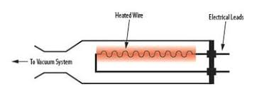
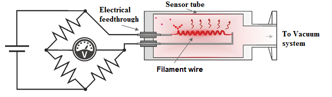
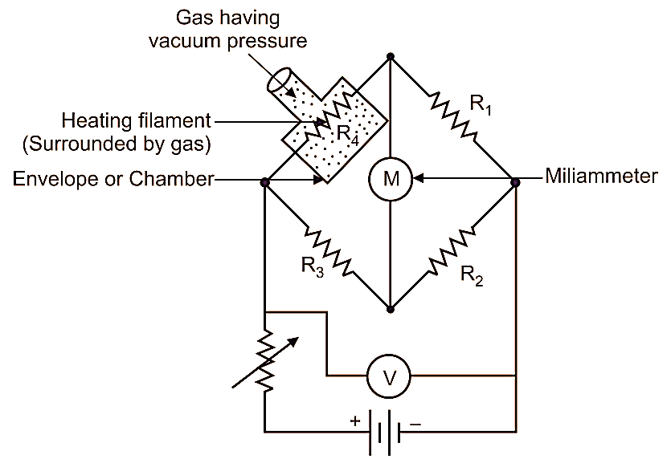
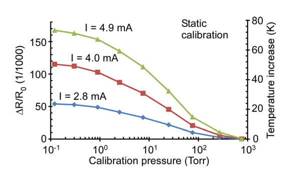
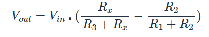

### INTRODUCTION :

The Pirani gauge is a device used to measure pressure, especially in vacuum systems. The Pirani gauge consists of a metal filament (usually platinum) suspended in a tube which is connected to the system whose vacuum is to be measured. The connection is usually made either by a ground glass joint or a flanged metal connector, sealed with an O-ring. The sensor wire is connected to an electrical circuit from which, after calibration, a pressure reading may be taken.
Below fig. shows overview of Pirani gauge. 

### WORKING OF THE PIRANI GAUGE : 
The heating filament is heated by a constant current. Therefore, Temperature of heating filament will increase. For a given magnitude of current, temperature of heating filament depends upon rate of heat dis- septation to surrounding medium, i.e., Gas by means of conduction and convection. After heating, the heating filament is placed or connected to vacuum or low-pressure surrounding gas medium. Now since, the heating filament is surrounded by vacuum or low-pressure gas, then thermal conductivity (i.e., ability of heating filament to give away heat to sur- rounding medium) of heating filament will also decrease. In such condition, the heating filament will be hotter. Change in temperature of heating filament will lead to change in resistance of wire, which can be measured by using Wheatstone bridge. The current under unbalanced condition is indicated by an ammeter in mA. We obtain an output reading, which is a function of temperature of heating filament and hence, the function of pressure of surrounding gas.

### Operation of Pirani gauge :

1.	A constant current is passed through the filament in the Pirani gauge chamber. Due to this current, the filament gets heated and assumes a resistance which is measured using the bridge.
2.	Now the pressure to be measured (applied pressure) is connected to the Pirani gauge chamber. Due to the applied pressure the density of the surrounding of the Pirani gauge filament changes. Due to this change in density of the surrounding of the filament its conductivity changes causing the temperature of the filament to change.
3.	When the temperature of the filament changes, the resistance of the filament also changes.
4.	Now the change in resistance of the filament is determined using the bridge.
5.	This change in resistance of the Pirani gauge filament becomes a measure of the applied pressure when calibrated.
Note: [higher pressure – higher density – higher conductivity – reduced filament temperature – less resistance of filament] and vice versa.

### Pirani Wheatstone bridge : 

Wheatstone Bridge is an instrument designed to measure unknown resistance in electrical circuits. It calculates the unknown resistance by balancing the two legs of the bridge circuit where one leg contains both known resistors and the other leg contains one known (variable) and one unknown resistor. Since it estimates unknown resistance in an electric circuit, it is also known as a resistance bridge. Wheatstone bridge is a very reliable instrument as it measures the resistance very precisely.
A conducting wire gets heated when electric current flows through it. The rate at which heat is dissipated from this wire depends on the conductivity of the surrounding media. 
The conductivity of the surrounding media in-turn depends on the density of the surrounding media that is, lower pressure of the surrounding media, lower will be its density. If the density of the surrounding media is low, its conductivity also will be low which causes the wire to become hotter for a given current flow, and vice versa.

### Thermal conductivity of Pt : 

The temperature dependence of the thermal conductivity of Pt shows a greater rate of increase with temperature.  Since the thermal conductivity of Pt at ambient conditions is about 70 W/m/K, the effect of temperature and pressure increases the thermal conductivity by about a factor of three. McWilliams proposed a model that describes the thermal conductivity of Pt (kPt) as a function of P and T: 

kPt = aP + bT + k0 (a, b, and k0 are constants). 

Values of a, b, and k0 are determined from current and previous κPt data and the recommended values at ambient pressure. The revised model based on this study is as follows:
kPt = 0.953P + 0.0137T + 61.8(W/m/K). 

Based on the result of the first-principles calculation, the thermal conductivity is approximately first-order correlated with the pressure, but near temperature dependence and becomes weaker or changes to a negative tendency. 

A constant current is provided to the Pirani gauges that are connected in series. From the change in &Delta;R&frasl;R0 with varying  pressure, at each current level, it is evident that the responses from 1 Torr to 100 Torr show greater sensitivity than those from 100 Torr to 760 Torr and from 0.1 Torr to 1 Torr. As the current varies from 2.83 mA to 4.90 mA, the   &Delta;R&frasl;R0 and the  &Delta; T are increased. The fractional change in resistance is approximately proportional to the square of the current. The maximum values of &Delta; T are 23.4 K for 2.8 mA, 49.9 K for 4.0 mA, and 68.2 K for 4.9 mA. Of these, the current of 4.9 mA provides the highest sensitivity in   &Delta;R&frasl;R0, as can be seen in the plots. However, in order to reduce the likelihood for thermal aging of the resistor, drift in resistance and non-linearity in fractional change in resistance, an operating current of 4 mA is selected. It is applied to the nominal R0 of 140 &Omega;. 

To solve for output voltage, Vout, given the Rx resistance, we use Kirchoff's Voltage Law (KVL) and Kirchoff's Current Law (KCL) to arrive at the following equation:

Where:
Vout = differential voltage across the Wheatstone bridge, in volts
Vin = input voltage to the Wheatstone bridge, in volts
Rx = resistor values, expressed in ohms

### Applications of Pirani gauge :
Used to measure low vacuum and ultra-high vacuum pressures.

### Advantages of Pirani gauge :

1.	Can read very low pressure from 1.33 × 10-6 bar to 1.33 × 10-3 bar (i.e., 0.133 Pa to 13.3 Pa).
2.	Relation between pressure and resistance is linear for the range of use.
3.	Portable.

### Limitations of Pirani gauge :
1.	Pirani gauge must be checked frequently.
2.	Pirani gauge must be calibrated from different gases.
3.	Electric power is a must for its operation.