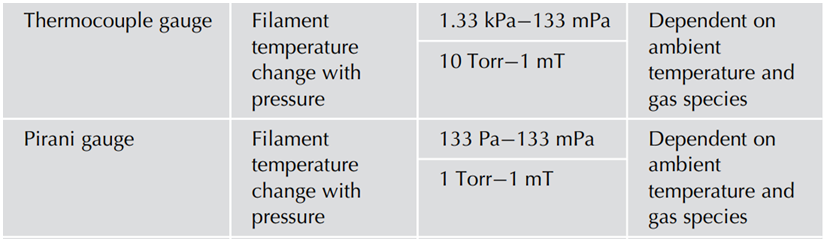
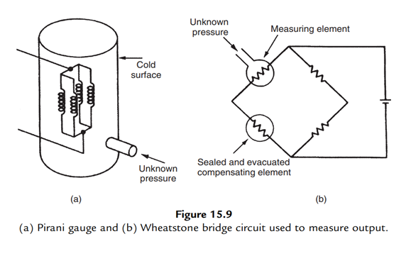
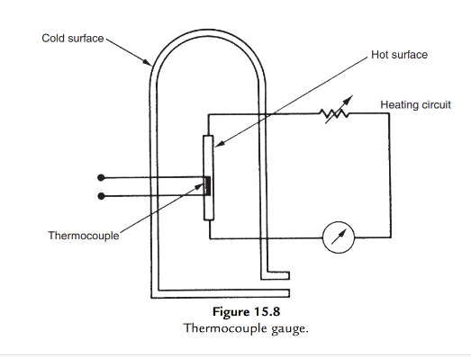

#### Introduction 

**PIRANI AND THERMOCOUPLE GAUGES**

The backing lines and roughing gauges require something more accurate when reaching a lower pressure than the capsule gauges. The thermocouple or Pirani gauge fits this requirement. These gauges use a current to heat a wire. The heated wire loses heat to the gas molecules that collide with the wire. Thus the higher the pressure the greater the number of molecules colliding with the wire and hence more heat is lost and the temperature of the wire is reduced. 

In the Pirani gauge, the wire is part of a bridge circuit and a change in the wire resistance can be measured. Similarly, if the pressure decreases the temperature of the wire will increase and again the changed resistance can be measured. The resistance is converted into a reading of pressure. 

In the thermocouple gauge, a thermocouple is spot welded directly to the resistance wire and so a direct temperature measurement is taken and converted into a pressure measurement. The gauges are sensitive to the type of gas in the system. The different gases have different masses and hence will take different amounts of heat out of the wire. However, this does mean that if the gauge is calibrated using air and is then used to measure a process gas such as Argon, there will be an error in the pressure measurement. The error is reproducible and so in most cases the pressure is accepted as being a relative, but reproducible, measure of pressure 

**Construction and Working of Pirani Gauge** 

A typical form of Pirani gauge is shown in Figure 15.9a. This is similar to a thermocouple gauge but has a heated element that consists of four coiled tungsten wires connected in parallel. Two identical tubes are normally used, connected in a bridge circuit, as shown in Figure 15.9b, with one containing the gas at unknown pressure and the other evacuated to a very low pressure. Current is passed through the tungsten element, which attains a certain temperature according to the thermal conductivity of the gas. The resistance of the element changes with temperature and causes an imbalance of the measurement bridge. Thus, the Pirani gauge avoids the use of a thermocouple to measure temperature (as in the thermocouple gauge) by effectively using a resistance thermometer as the heated element. Such gauges cover the pressure range 105 to 1 mbar.

**Construction and Working**

The thermocouple gauge is one of a group of gauges working on the thermal conductivity principle. At low pressure, the kinematic theory of gases predicts a linear relationship between pressure and thermal conductivity. Thus measurement of thermal conductivity gives an indication of pressure. Figure 15.8 shows a sketch of a thermocouple gauge. Operation of the gauge depends on the thermal conduction of heat between a thin hot metal strip in the center and the cold outer surface of a glass tube (that is normally at room temperature). The metal strip is heated by passing a current through it and its temperature is measured by a thermocouple. The temperature measured depends on the thermal conductivity of the gas in the tube and hence on its pressure. A source of error in this instrument is the fact that heat is also transferred by radiation as well as conduction. This error is of a constant magnitude, independent of pressure. Hence, it can be measured, and thus correction can be made for it. However, it is usually more convenient to design for low radiation loss by choosing a heated element with low emissivity. Thermocouple gauges are typically used to measure pressures in the range 104 mbar up to 1 mbar.

**Advantages of thermal conduction vacuum gauges**

1. The thermal conduction vacuum gauge reflects the full pressure, that is, the true pressure of the tested container.
2. The thermal conduction vacuum gauge can measure continuously and support remote-reading.
3. The thermal conduction vacuum gauge has simple structure and it is easy to manufacture.
4. Even if suddenly encounter the atmosphere, the heat transfer vacuum gauge will not be burned.

**Disadvantages of thermal conduction vacuum gauges**

1. The calibration curve varies with the type of gas, so the calibration curve for air can not be directly used for other gases.
2. The thermal conduction vacuum gauge has the thermal inertia for measuring. The temperature change of the hot wire often lags when the pressure changes, and the reading also lags behind for some time.
3. The thermal conduction vacuum gauge is affected seriously by of the outside temperature, so the gauge should be installed in a place that is not susceptible to radiation or convection heat.
4. Because of serious aging, it must be calibrated regularly.

**Applications** 

Pressure gauges have a broad range of industrial applications spanning research and development to nautical and manufacturing. More importantly, gauge sensors are used in manufacturing to ensure the proper functioning of equipment to guarantee worker safety.

Pharmaceutical, paper milling, and offshore oil drilling companies are other sectors that heavily rely on vacuum technologies for their day-to-day operations. Petroleum refineries and chemical plants use vacuum pressure gauges to move gas and liquid materials through their systems. Site workers rely on pressure instruments to remove pollutants from working sites.

